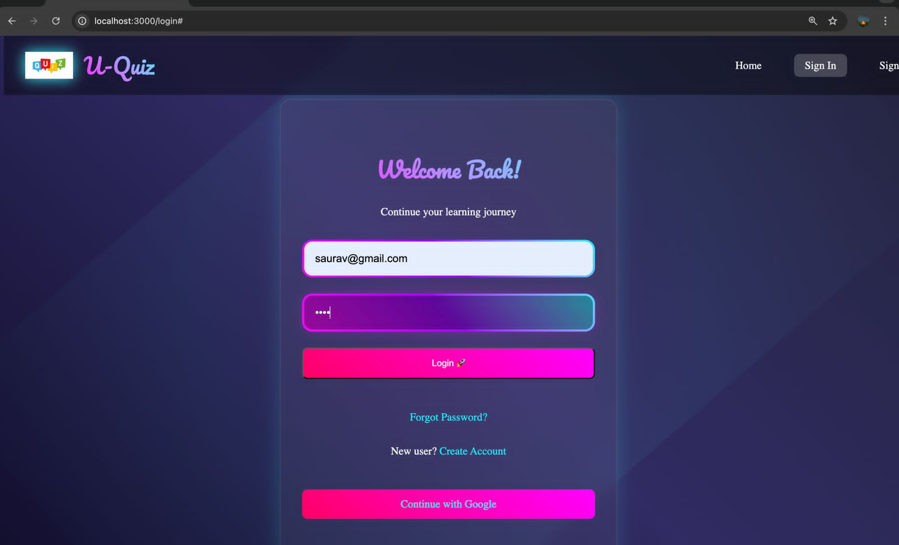
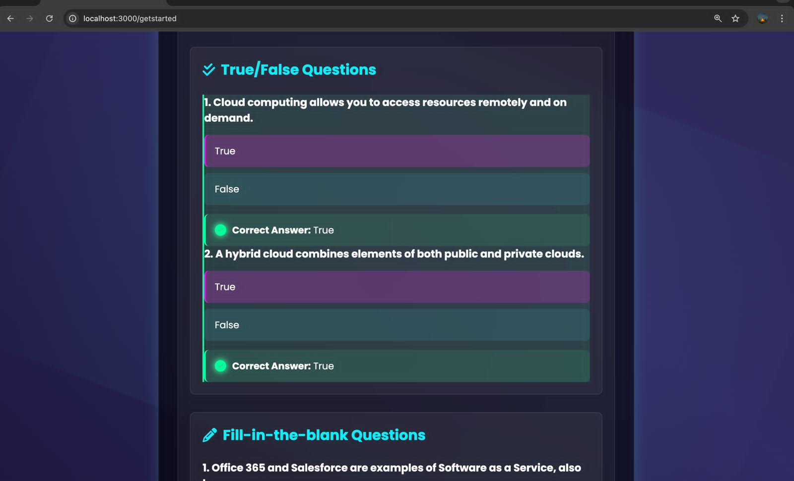
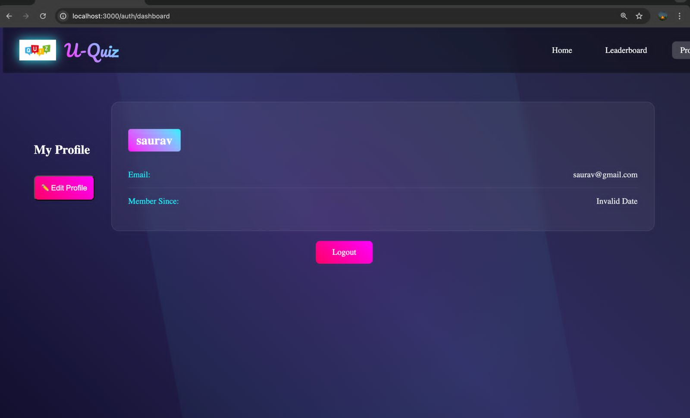
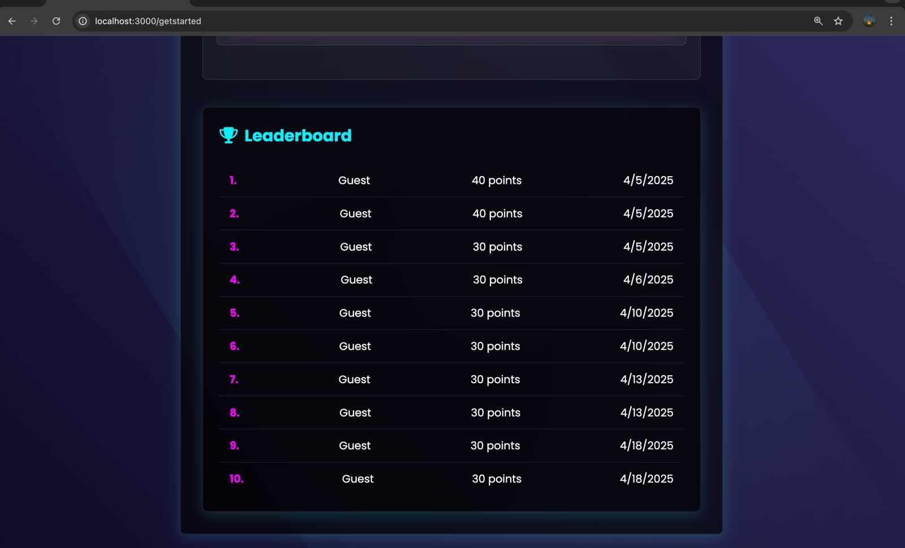
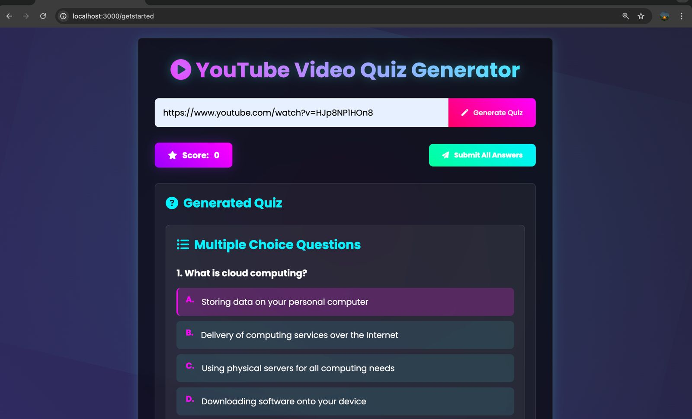
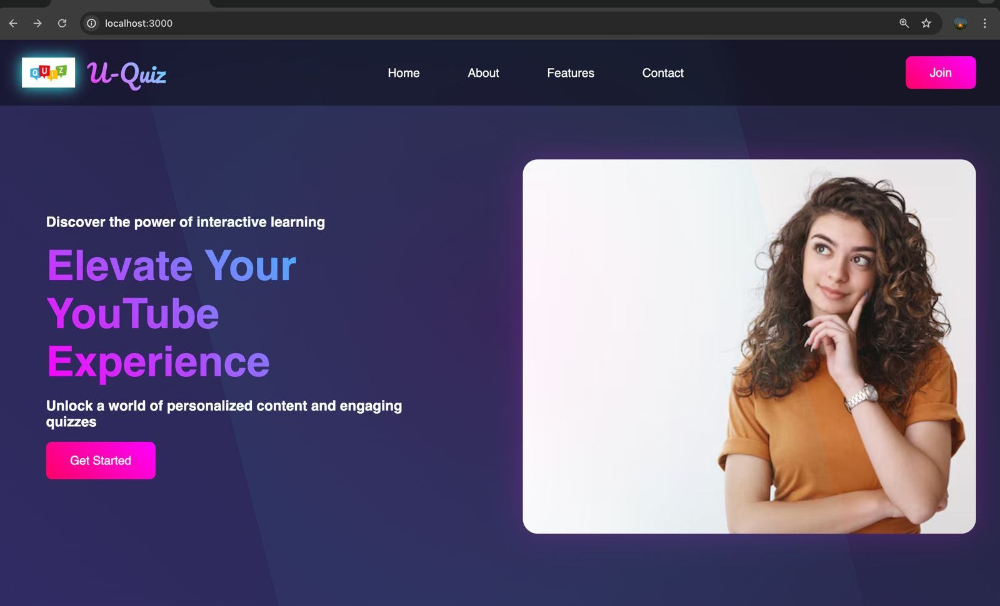

<div align="center">

# 🟣🔵 U-Quiz — Interactive Learning Platform 🔵🟣

### 🎓 Transform YouTube Learning into Interactive Quizzes


---


</div>

---

# ✨ Introduction

**U-Quiz** is a modern **gamified learning platform** that turns YouTube videos into interactive quizzes.

Instead of passively watching content, users can **test their understanding, compete with others, and track learning progress** through leaderboards and dashboards.

The goal is to make **learning engaging, competitive, and fun**.

---

## 🟣 Tech Stack

| Technology | Purpose |
|-----------|--------|
| React.js | Frontend UI |
| Node.js / Express | Backend API |
| MongoDB | Database |
| TailwindCSS | Styling |
| JWT | Authentication |
| Gemini API | AI-powered question generation |
| YouTube Data API | Fetch video metadata |

---

# 🚀 Features

### 🔐 Authentication

Secure user login using **Email / Password** and **Google Sign-In**.

### 🎥 YouTube Quiz Generator

Automatically generate **MCQs from YouTube videos**.

### 🧠 Multiple Question Types

Supports:

* Multiple Choice Questions
* True / False
* Fill in the Blank

### 👤 Personalized Dashboard

Track progress, performance and learning statistics.

### 🏆 Leaderboard

Compete with other users and **climb the ranks**.

### 🎨 Modern UI

Clean **blue-purple gradient interface** for immersive experience.

---

# ⚡ Quick Start

### 1️⃣ Clone the Repository

```bash
git clone https://github.com/yourusername/uquiz.git
```

### 2️⃣ Navigate to Project Folder

```bash
cd uquiz
```

### 3️⃣ Install Dependencies

```bash
npm install
```

### 4️⃣ Run Development Server

```bash
npm run dev
```

---

## 🔵 Learning Flow

🔐 **Login / Register**  
Create your account securely.

🎥 **Generate Quiz**  
Choose a YouTube video or playlist.

🧠 **Attempt Quiz**  
Answer interactive MCQs and test your knowledge.

📊 **Track Progress**  
Monitor performance in the dashboard.

🏆 **Compete**  
Climb the leaderboard and challenge friends.

---

# 🖼️ Screenshots

<div align="center">

### 🔐 Login & 📚 Quiz




**Figure 1:** Login interface with email and Google sign-in
**Figure 2:** Interactive quiz interface

---

### 👤 Dashboard & 🏆 Leaderboard




**Figure 3:** User dashboard with profile details
**Figure 4:** Leaderboard showing rankings and scores

---

### 🎥 Quiz Generator & 🌐 Landing Page




**Figure 5:** YouTube video quiz generator
**Figure 6:** Landing page highlighting features

</div>

---

# 📦 Assets

* 🎨 **Logo & Branding:** Blue-purple gradient theme
* 📸 **Screenshots:** Login, Dashboard, Leaderboard, Quiz Generator
* 🎬 **Interactive UI Components**

---

# 🌟 Future Roadmap

* 🤖 **AI-Powered Question Generation**
* 📱 **Mobile App Version**
* 🌍 **Social Sharing of Quiz Results**
* 🧑‍🤝‍🧑 **Multiplayer Quiz Mode**

---

<div align="center">

## 🔵 Made with passion for interactive learning

### **U-Quiz — Elevate Your YouTube Learning Experience**

</div>

